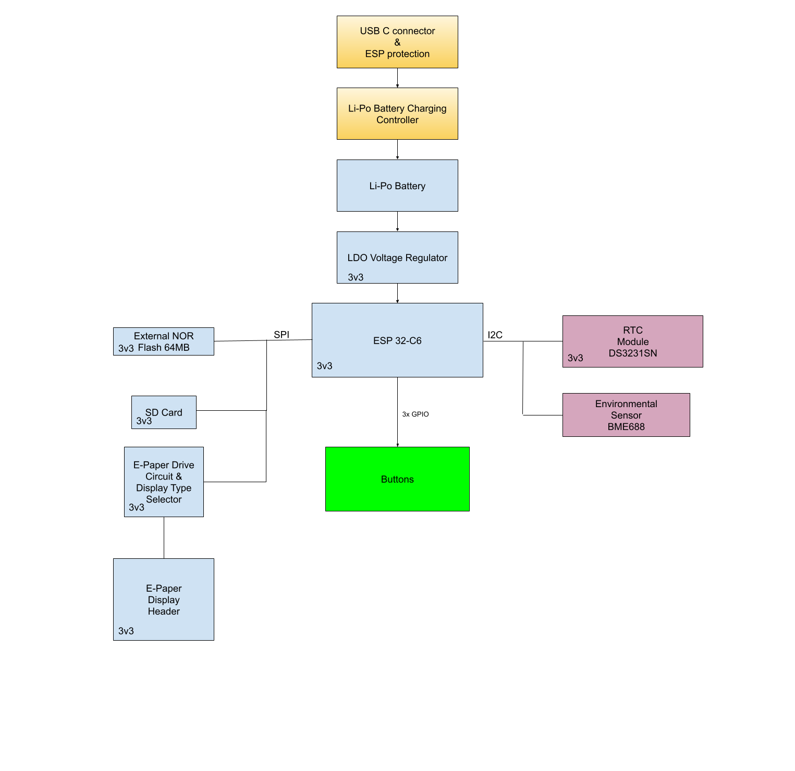

# README

## Diagrama bloc
 

---
## Bill Of Materials (BOM)
| Componentă                  | Procurare                                                                                                                                                                   | Datasheet                                               |
|-----------------------------|-----------------------------------------------------------------------------------------------------------------------------------------------------------------------------|---------------------------------------------------------|
| Button                      | [Mouser](https://ro.mouser.com/ProductDetail/CK/KMR221GULCLFS?qs=u2NJ%252B70r0goBXaNk7IrU0Q%3D%3D)                                                                          |[Datasheet](https://www.ckswitches.com/media/1479/kmr2.pdf)|
| Capacitor SUPERCAP          | [Mouser](https://ro.mouser.com/ProductDetail/Seiko-Semiconductors/CPH3225A?qs=3etwrb1wR%252BhUOph6lAO7eg%3D%3D)                                                             | [Datasheet](https://ro.mouser.com/datasheet/2/360/Seiko_Instruments_MicroBattery_E_20230330_2024Jan_-3561061.pdf)|
| Capacitor 100nF             | [Mouser](https://ro.mouser.com/ProductDetail/KEMET/C0402C104K4RAL?qs=pIZUS6sqCWCaMuP2QVR%2Fog%3D%3D)                                                                        | [Datasheet](https://ro.mouser.com/datasheet/2/447/KEM_C1018_X7R_SnPb_SMD-3316276.pdf)|
| Capacitor 4.7uF             | [Mouser](https://ro.mouser.com/ProductDetail/KEMET/C0402C475M9PAC7411?qs=cpo3%2FpBou2jRzZxyxJnMGg%3D%3D)                                                                    | [Datasheet](https://ro.mouser.com/datasheet/2/447/KEM_C1006_X5R_SMD-3316465.pdf)|
| Capacitor 100uF TANT        | [Mouser](https://ro.mouser.com/ProductDetail/KYOCERA-AVX/TAJW107M010RNJ?qs=Wtp%252Bf%2FAeVqIH8v1VxV%252B1Rg%3D%3D)                                                          | [Datasheet](https://ro.mouser.com/datasheet/2/40/TAJ-3165264.pdf)|
| Capacitor 4.7uF / 25V       | [Mouser](https://ro.mouser.com/ProductDetail/KYOCERA-AVX/12063C475KAZ2A?qs=%252BdQmOuGyFcG3LdbVp5waMw%3D%3D)                                                                | [Datasheet](https://ro.mouser.com/datasheet/2/40/X7RDielectric-2943470.pdf)|
| Capacitor 1uF               | [Mouser](https://ro.mouser.com/ProductDetail/KEMET/C0402C105K9PACTU?qs=UdQET6xYxVCMExqTDkuPeQ%3D%3D)                                                                        | [Datasheet](https://ro.mouser.com/datasheet/2/447/KEM_C1006_X5R_SMD-3316465.pdf)|
| Capacitor 10uF              | [Mouser](https://ro.mouser.com/ProductDetail/KEMET/C0402C106M9PACTU?qs=x4XeXhDQKnp%252Bz0lMlwMC3A%3D%3D)                                                                    | [Datasheet](https://ro.mouser.com/datasheet/2/447/KEM_C1006_X5R_SMD-3316465.pdf)|
| CHG_LED                     | [CPC](https://cpc.farnell.com/kingbright/kpg-1608zgc/led-smd-0603-grn/dp/SC20796)                                                                                           | [Datasheet](https://www.farnell.com/datasheets/2046349.pdf)|
| USBLC6-2SC6Y                | [Mouser](https://ro.mouser.com/ProductDetail/STMicroelectronics/USBLC6-2SC6Y?qs=gNDSiZmRJS%2FOgDexvXkdow%3D%3D)                                                             | [Datasheet](https://ro.mouser.com/datasheet/2/389/usblc6_2sc6y-1852505.pdf)|
| PGB1010603MR                | [Mouser](https://ro.mouser.com/ProductDetail/Littelfuse/PGB1010603MR?qs=gu7KAQ731URLg4GSnNNN7Q%3D%3D)                                                                       | [Datasheet](https://www.littelfuse.com/assetdocs/pulseguard-esd-suppressors-pgb1-datasheet?assetguid=8a337998-d54d-466b-be4e-dc5bcd1f9321)|
| SD0805S020S1R0              | [Mouser](https://ro.mouser.com/ProductDetail/KYOCERA-AVX/SD0805S020S1R0?qs=jCA%252BPfw4LHbpkAoSnwrdjw%3D%3D)                                                                | [Datasheet](https://ro.mouser.com/datasheet/2/40/schottky-3165252.pdf)|
| MBR0530                     | [Mouser](https://ro.mouser.com/ProductDetail/onsemi/MBR0530T3G?qs=3JMERSakebpEmdUS6GetdQ%3D%3D)                                                                             | [Datasheet](https://www.onsemi.com/products/discrete-power-modules/schottky-diodes-schottky-rectifiers/mbr0530t3g)|
| Capacitor 1uF / 50V         | [Mouser](https://ro.mouser.com/ProductDetail/TDK/C1608X7R1H105K080AB?qs=sGAEpiMZZMsh%252B1woXyUXjwVqLNpRsvnQGmKhuYn4DWE%3D)                                                 | [Datasheet](https://product.tdk.com/system/files/dam/doc/product/capacitor/ceramic/mlcc/catalog/mlcc_commercial_general_en.pdf)|
| Capacitor 0.1uF / 50V       | [Farnell](https://ro.farnell.com/multicomp-pro/mcmlr50v104kx7r/ceramic-capacitor-0-1uf-50v-x7r/dp/1600875?srsltid=AfmBOop-NuqSwaWYAsNDvdMnjraBeqfj0sl8f99iLZ_KJc8xpnT4fSqT) | [Datasheet](https://www.farnell.com/datasheets/2873577.pdf?_gl=1*x28a2*_gcl_au*MTYwODAzNzc2OC4xNzQzNDM1MjM4)|
| BD5229G-TR                  | [Mouser](https://ro.mouser.com/ProductDetail/ROHM-Semiconductor/BD5229G-TR?qs=4kLU8WoGk0vvnhrrYwdszw%3D%3D)                                                                 | [Datasheet](https://fscdn.rohm.com/en/products/databook/datasheet/ic/power/voltage_detector/bd52xxg-e.pdf)|
| XC6220A331MR-G              | [Mouser](https://ro.mouser.com/ProductDetail/Torex-Semiconductor/XC6220A331MR-G?qs=AsjdqWjXhJ8ZSWznL1J0gg%3D%3D)                                                            | [Datasheet](https://ro.mouser.com/datasheet/2/760/xc6220-3371556.pdf)|
| FH34SRJ-24S-0.5SH_99_       | [Mouser](https://ro.mouser.com/ProductDetail/Hirose-Connector/FH34SRJ-24S-0.5SH99?qs=vcbW%252B4%252BSTIpKBl5ap9J8Fw%3D%3D)                                                  | [Datasheet](https://ro.mouser.com/datasheet/2/185/FH34SRJ_24S_0_5SH_99__CL0580_1255_6_99_2DDrawing_0-1615044.pdf)|
| SAMACSYS_PARTS_USB4110-GF-A | [Mouser](https://ro.mouser.com/ProductDetail/GCT/USB4110-GF-A?qs=KUoIvG%2F9IlYiZvIXQjyJeA%3D%3D)                                                                            | [Datasheet](https://ro.mouser.com/datasheet/2/837/GCT_USB4110_Product_Drawing___20k_cycles-3455479.pdf)|
| QWIIC_RIGHT_ANGLEA          | [Mouser](https://ro.mouser.com/ProductDetail/JST-Commercial/SM04B-SRSS-TBLFSN?qs=cdbOS8ANM9B3FdyA6cNU2A%3D%3D)                                                              | [Datasheet](https://ro.mouser.com/datasheet/2/564/eSR_SZ-3476820.pdf)|
| 112A-TAAR-R03_ATTEND        | [LCSC](https://www.lcsc.com/product-detail/SD-Card-Connectors_Attend-Technology-112A-TAAR-R03_C6970445.html)                                                                | [Datasheet](https://www.lcsc.com/datasheet/lcsc_datasheet_2411220717_Attend-Technology-112A-TAAR-R03_C6970445.pdf)|
| Bobina                      | [Mouser](https://ro.mouser.com/ProductDetail/Wurth-Elektronik/744043680?qs=PGXP4M47uW6VkZq%252BkzjrHA%3D%3D)                                                                | [Datasheet](https://www.we-online.com/components/products/datasheet/744043680.pdf)|
| MCP73831                    | [Mouser](https://ro.mouser.com/ProductDetail/Microchip-Technology/MCP73831-2ACI-MC?qs=hH%252BOa0VZEiBneYTVdpuVdg%3D%3D)                                                     | [Datasheet](https://ro.mouser.com/datasheet/2/268/MCP73831_Family_Data_Sheet_DS20001984H-3441711.pdf)|
| PFMF.050.1                  | [Mouser](https://ro.mouser.com/ProductDetail/Schurter/PFMF.050.2?qs=1auRipcfynCums5v1iucSA%3D%3D)                                                                           | [Datasheet](https://ro.mouser.com/datasheet/2/358/typ_PFMF-1275918.pdf)|
| DMG2305UX-7                 | [Mouser](https://ro.mouser.com/ProductDetail/Diodes-Incorporated/DMG2305UX-7?qs=L1DZKBg7t5F%2FNBHrjfxC%252Bg%3D%3D)                                                         | [Datasheet](https://www.diodes.com/assets/Datasheets/DMG2305UX.pdf)|
| SI1308EDL-T1-GE3            | [Mouser](https://ro.mouser.com/ProductDetail/Vishay-Semiconductors/SI1308EDL-T1-GE3?qs=bX1%252BNvsK%2FBramh9tgpOaEw%3D%3D)                                                  | [Datasheet](https://www.vishay.com/docs/63399/si1308edl.pdf)|
| Resistor 10K                | [DigiKey](https://www.digikey.com/en/products/detail/venkel/CR0402-10W-102JT/12332774)                                                                                      | [Datasheet](https://data.venkel.com/documents/cr-series?_gl=1*mn27ew*_ga*MTAzMTIxOTYyMS4xNzQzNzU5MjAy*_ga_JRKGBZNVM8*MTc0Mzc1OTIwMS4xLjAuMTc0Mzc1OTIwMi41OS4wLjA.)|
| Resistor 100K               | [Venkel](https://venkel.com/part/CR0402-16W-1003FT)                                                                                                                         | [Datasheet](https://data.venkel.com/documents/cr-series?_gl=1*oleae1*_ga*MTAzMTIxOTYyMS4xNzQzNzU5MjAy*_ga_JRKGBZNVM8*MTc0Mzc1OTIwMS4xLjEuMTc0Mzc1OTM0My4zNi4wLjA.)|
| Resistor 5k1                | [Venkel](https://venkel.com/part/CR0402-10W-5101FT)                                                                                                                         | [Datasheet](https://data.venkel.com/documents/cr-series?_gl=1*1e041jc*_ga*MTAzMTIxOTYyMS4xNzQzNzU5MjAy*_ga_JRKGBZNVM8*MTc0Mzc1OTIwMS4xLjEuMTc0Mzc1OTU2Ny41MS4wLjA.)|
| Resistor 2k                 | [Venkel](https://www.venkel.com/part/CR0402-16W-2002FT)                                                                                                                     | [Datasheet](https://data.venkel.com/documents/cr-series?_gl=1*1sqolfs*_ga*MTAzMTIxOTYyMS4xNzQzNzU5MjAy*_ga_JRKGBZNVM8*MTc0Mzc1OTIwMS4xLjEuMTc0Mzc1OTY2OS4zNC4wLjA.)|
| Resistor 0.47               | [Mouser](https://ro.mouser.com/ProductDetail/Vishay-Beyschlag/MCT06030C4700FP500?qs=XsZ9OvPb0dt82KlzjdcMjQ%3D%3D)                                                           | [Datasheet](https://www.vishay.com/docs/28705/mcx0x0xpro.pdf)|
| BME688               | [Mouser](https://ro.mouser.com/ProductDetail/Bosch-Sensortec/BME688?qs=IS%252B4QmGtzzqQoVDscqwx3A%3D%3D)                                                           | [Datasheet](https://ro.mouser.com/datasheet/2/783/bst_bme688_fl000-2307034.pdf)|
| W25Q512JVEIQ               | [Mouser](https://ro.mouser.com/ProductDetail/Winbond/W25Q512JVEIQ?qs=l7cgNqFNU1jw6svr3at6tA%3D%3D)                                                           | [Datasheet](https://ro.mouser.com/datasheet/2/949/Winbond_W25Q512JV_Datasheet-3240039.pdf)|
| ESP32-C6-WROOM-1-N8               | [Mouser](https://ro.mouser.com/ProductDetail/Espressif-Systems/ESP32-C6-WROOM-1-N8?qs=8Wlm6%252BaMh8ST02Gmwp74cw%3D%3D)                                                           | [Datasheet](https://ro.mouser.com/datasheet/2/891/Espressif_ESP32_C6_WROOM_1__Datasheet_V0_1_PRELIMI-3239987.pdf)|
| DS3231SN#               | [Mouser](https://ro.mouser.com/ProductDetail/Analog-Devices-Maxim-Integrated/DS3231SN?qs=1eQvB6Dk1vhUlr8%2FOrV0Fw%3D%3D)                                                           | [Datasheet](https://ro.mouser.com/datasheet/2/609/DS3231-3421123.pdf)|
| MAX17048G+T10               | [Mouser](https://ro.mouser.com/ProductDetail/Analog-Devices-Maxim-Integrated/MAX17048G%2bT10?qs=D7PJwyCwLAoGnnn8jEPRBQ%3D%3D)                                                           | [Datasheet](https://ro.mouser.com/datasheet/2/609/MAX17048_MAX17049-3469099.pdf)|
---
# Functionalitatea Hardware

**Sursa de Alimentare si Energie:**
- **USB cu ESD:** Protectie la alimentare si transfer de date.
- **Circuit de Incarcare Li-Po - MCP73831:** Managementul controlat al incarcarii pentru acumulatorul de 1800 mAh.
- **Baterie Li-Po & LDO Voltage Regulator:** Stabilizeaza tensiunea la 3.3V pentru componentele sistemului.

**Microcontroller & Interfete:**
- **ESP32-C6:**
    - **SPI:** Interconecteaza memoria NOR Flash, cardul SD și displayul e-paper.
    - **I2C:** Faciliteaza comunicarea cu RTC DS3231, senzorul BME688 și modulele aditionale.
    - **UART:** Dedicat pentru debugging și comunicatii seriale.
    - **GPIO:** Utilizat pentru butoane si puncte de testare.

**Module de Stocare & Afisare:**
- **Memorie NOR Flash (SPI):** Stocare eficienta pentru firmware si date operationale.
- **Card SD (SPI):** Ofera capacitate de stocare suplimentara.
- **E-Paper Display:** Asigura vizualizari precise cu consum energetic minim, operat prin SPI.

**Module Suplimentare & Senzori:**
- **RTC DS3231 (I2C):** Furnizeaza timpul real sistemului.
- **Senzor BME688 (I2C):** Monitorizeaza temperatura, umiditatea, presiunea si calitatea aerului.
- **Conector Qwiic/Stemma QT (I2C):** Faciliteaza integrarea modulelor aditionale.
- **Test Pads & Butoane (GPIO):** Suporta diagnosticarea si interactiunea directa.

**Optimizare Energetica:**
- **Mod Low-Power al ESP32-C6:** Optimizeaza consumul prin ajustarea dinamica a frecventei si ciclurilor active.
- **Stabilitate prin LDO:** Garanteaza o tensiune stabila de 3.3V.
- **Componente SMD (ex: capsula 0402):** Reduce consumul energetic prin dimensiuni compacte si eficienta ridicata.

---

# ESP32-C6 Pin Mapping

| Nume | GPIO        | Utilizare                                      | Observații                                                                                                                      |
|------|-------------|------------------------------------------------|---------------------------------------------------------------------------------------------------------------------------------|
| 3V3  | 3V3         | Alimentare 3.3V                                | Sursa de tensiune pentru ESP32-C6 și componente logice.                                                                         |
| SCK (SPI) | IO6         | Clock pentru SPI                               | Asigură semnalul de ceas pentru transferuri rapide.                                                                             |
| MOSI (SPI) | IO7         | Transmitere date SPI                           | Trimite date către NOR Flash, SD Card și E-Paper.                                                                               |
| MISO (SPI) | IO2         | Recepție date SPI                              | Primește date de la dispozitivele SPI.                                                                                          |
| FLASH_CS | IO11        | Selectare SPI pentru NOR Flash                 | Selectează memoria NOR Flash pe magistrala SPI.                                                                                 |
| EPD_CS | IO10        | Selectare SPI pentru E-Paper                   | Selectează afișajul e-paper.                                                                                                    |
| SDA (I2C) | IO21        | Linie de date I2C                              | Conectează RTC DS3231, senzorul BME688 și conectorul Qwiic/Stemma QT.                                                           |
| SCL (I2C) | IO22        | Linie de ceas I2C                              | Sincronizează comunicația I2C.                                                                                                  |
| TX (UART) | TXD0/GPIO16 | Transmitere date UART                          | Utilizat pentru debug și comunicații seriale.                                                                                   |
| RX (UART) | RXD0/GPIO17 | Recepție date UART                             | Utilizat pentru debug și comunicații seriale.                                                                                   |
| Buton Reset | EN          | Resetare ESP32-C6                              | Pin dedicat pentru resetul sistemului.                                                                                          |
| Buton Boot | IO9         | Intrare în bootloader                          | Pin dedicat pentru a intra în modul boot.                                                                                       |
| Buton Change | IO15        | Schimbare mod operare                          | Permite comutarea între modurile de funcționare.                                                                                |
| EPD DC | IO5         | Data/Command pentru E-Paper                    | Disting între semnal de comandă și semnal de date pentru afișaj.                                                                |
| EPD RST | IO23        | Resetare E-Paper                               | Resetează afișajul e-paper când este necesar.                                                                                   |
| EPD BUSY | IO3         | Indicator stare E-Paper                        | Semnal care indică dacă afișajul este ocupat.                                                                                   |
| INT_RTC | IO0         | Semnal de întrerupere de la RTC (DS3231)        | Activează microcontrolerul.                                                                                                     |
| 32KHZ | IO1         | Semnal de ceas 32 kHz                 | Linie de oscilație pentru DS3231 sau alt modul (nu intră direct în ESP).                                                        |
| SS_SD| IO4         | Chip Select pentru card SD (SPI)                | Selectează cardul SD pe magistrala SPI.                                                                                         |
| USB_D- | IO12        | Linie diferențială USB (minus)                  | Conexiune la portul USB.                                                                                                        |
| USB_D+ | IO13        | Linie diferențială USB (plus)                   | Conexiune la portul USB.                                                                                                        |
| RTC_RST | IO18        | Reset extern/semnal RTC                         | Folosit pentru a reseta ceasul de timp real                                                                                     |
| I2C_PW | IO19        | Linia de alimentare / enable pentru I2C         | Activează/dezactivează alimentarea senzorilor I2C pentru economisirea energiei.                                                 |
| EPD_3V3_C | IO20        | Linie de alimentare 3.3V pentru E-Paper         | Această linie furnizează 3.3V specifice afișajului e-paper, separate de alimentarea principală, pentru stabilitatea semnalelor. |

---
## Motivatie

- **SPI** (SCK, MOSI, MISO, CS-uri) asigura transferul accelerat pentru memoria externa (Flash), cardul SD si ecranul e-paper.
- **I2C** (SDA, SCL) integreaza senzorii (RTC, BME688) si conectorul Qwiic, permitand utilizarea comuna a magistralei cu impact redus asupra consumului energetic.
- **UART** (TX, RX) este implementat pentru scopuri de debugging.
- **GPIO suplimentare** (butoane, test pads) ofera suport pentru controlul manual si procesele de diagnosticare.

---

## Pasii de Implementare

- **Schematic:** Am proiectat schematicul in concordanta cu specificatiile proiectului.
- **Redesenarea PCB-ului:** Am reconstruit placa PCB și am aranjat componentele conform referintei de design.
- **Autorutare:** Am implementat autorutarea pe ambele fete, cu grosimea traseelor de semnal de 0.15mm.
- **Net Class pentru Putere:** Am organizat traseele de alimentare intr-un netclass dedicat, le-am evidential cromatic si le-am dimensionat manual la 0.3mm pentru o distributie optima a energiei.
- **Planuri de Masă si Via Stitching:** Am implementat planurile de masă pe ambele fete si am aplicat via stitching in proximitatea modulului ESP pentru conexiuni eficiente intre straturi.
- **Modele 3D:** Am procurat modelele 3D ale componentelor de pe [ComponentSearchEngine](https://componentsearchengine.com/), le-am incorporat în Fusion 360 si le-am plasat adecvat pe PCB.
- **Integrarea in Carcasa:** Am incorporat placa in carcasa si am adaptat designul carcasei pentru a acomoda butoanele si conectorii.
- **Modelele 3D pentru Baterie si Display:** Am dezvoltat reprezentarile 3D pentru baterie si display, conectand conductorii la punctele de test corespunzatoare si asigurand pozitionarea optima in carcasa.
- **Export:** In etapa finala, am generat documentatia necesara - fisiere Gerber, Pick and Place (CPL) si BOM, pregatindu-le pentru procesul de fabricatie.

---

## Probleme Intampinate si Decizii de Acceptare a Erorilor

- **Erori SMD-Hole Board Outline Clearance la Mufa USB:**  
  Am identificat doua erori de tip SMD-Hole Board Outline Clearance asociate mufei USB. Aceste erori au fost considerate acceptabile conform indicatiilor tehnice primite.

---
