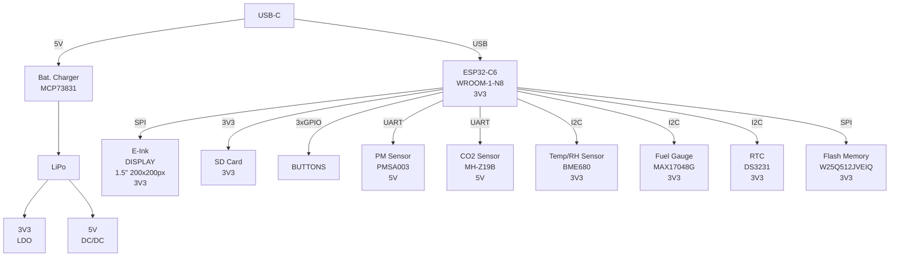

# README pentru Proiect PCB cu ESP32-C6

## Cuprins
1. [Diagrama bloc](#diagrama-bloc)
2. [BOM (Bill of Materials)](#bom-bill-of-materials)
3. [Descrierea funcționalității hardware](#descrierea-functionalității-hardware)
4. [Utilizarea pinilor ESP32-C6](#utilizarea-pinilor-esp32-c6)
5. [Informații suplimentare](#informații-suplimentare)

## Diagrama bloc

## BOM (Bill of Materials)

| Nr. | Componentă | Cantitate | Descriere | Link achiziție | Datasheet |
|-----|------------|-----------|-----------|----------------|-----------|
| 1 | ESP32-C6-WROOM-1-N8 | 1 | Microcontroller cu Wi-Fi 6 și Bluetooth 5.3 | [Mouser] | [Datasheet] |
| 2 | W25Q512JVEIQ | 1 | Memorie Flash 512Mbit | [Mouser] | [Datasheet] |
| 3 | DS3231SN# | 1 | RTC (Real-Time Clock) | [Mouser] | [Datasheet] |
| 4 | MAX17048G+T10 | 1 | Fuel Gauge IC pentru baterii Li-Ion | [Mouser] | [Datasheet] |
| 5 | BME680 | 1 | Senzor de temperatură, umiditate, presiune și gaz | [Mouser] | [Datasheet] |
| 6 | MCP73831 | 1 | Controller încărcare baterii Li-Ion/Li-Polymer | [Mouser] | [Datasheet] |
| 7 | BD5229G-TR | 1 | Regulator de tensiune | [Mouser] | [Datasheet] |
| 8 | XC6220A331MR-G | 1 | Regulator LDO | [Mouser] | [Datasheet] |
| 9 | USBLC6-2SC6Y | 1 | Protecție ESD pentru USB | [Mouser] | [Datasheet] |
| 10 | PGB1010603MR | 6 | Dispozitiv de protecție ESD | [Mouser] | [Datasheet] |
| 11 | MBR0530 | 3 | Diodă Schottky | [Mouser] | [Datasheet] |
| 12 | SI1308EDL-T1-GE3 | 1 | Tranzistor MOSFET | [Mouser] | [Datasheet] |
| 13 | "20V/4.2A/52mO/1.4W" | 2 | Tranzistor MOSFET de putere | [Mouser] | [Datasheet] |
| 14 | BUTTON_CUSYOMV1 | 3 | Butoane (BOOT, RESET, CHANGE) | [Mouser] | [Datasheet] |
| 15 | USB4110-GF-A | 1 | Conector USB | [Mouser] | [Datasheet] |
| 16 | QWIIC_RIGHT_ANGLE | 1 | Conector Qwiic | [Mouser] | [Datasheet] |
| 17 | 112A-TAAR-R03_ATTEND | 1 | Conector microSD | [Mouser] | [Datasheet] |
| 18 | FH34SRJ-24S-0.5SH_99_ | 1 | Conector FPC | [Mouser] | [Datasheet] |
| 19 | 744043680IND_4828-WE-TPC_WRE | 1 | Inductor | [Mouser] | [Datasheet] |
| 20 | CPH3225A | 1 | Supercapacitor | [Mouser] | [Datasheet] |
| 21 | Condensatori |  |  |  |  |
|  | 100nF | 9 | Condensator ceramic | [Mouser] | [Datasheet] |
|  | 4.7uF | 6 | Condensator ceramic | [Mouser] | [Datasheet] |
|  | 100uF TANT | 1 | Condensator tantal | [Mouser] | [Datasheet] |
|  | 4.7uF/25V | 1 | Condensator ceramic | [Mouser] | [Datasheet] |
|  | 1uF | 1 | Condensator ceramic | [Mouser] | [Datasheet] |
|  | 10uF | 1 | Condensator ceramic | [Mouser] | [Datasheet] |
|  | 1uF/50V | 8 | Condensator ceramic | [Mouser] | [Datasheet] |
|  | 0.1uF/50V | 1 | Condensator ceramic | [Mouser] | [Datasheet] |
| 22 | Rezistori |  |  |  |  |
|  | 10k | 14 | Rezistor | [Mouser] | [Datasheet] |
|  | 200 | 1 | Rezistor | [Mouser] | [Datasheet] |
|  | 2.2 | 1 | Rezistor | [Mouser] | [Datasheet] |
|  | 5k1 | 2 | Rezistor | [Mouser] | [Datasheet] |
|  | 2k | 1 | Rezistor | [Mouser] | [Datasheet] |
|  | 0.47 | 1 | Rezistor | [Mouser] | [Datasheet] |
|  | 15 | 1 | Rezistor | [Mouser] | [Datasheet] |
| 23 | TPTP20R | 14 | Puncte de test | [Mouser] | [Datasheet] |